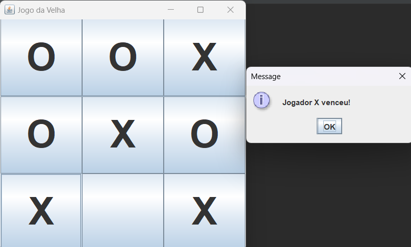

# Jogo da Velha (Swing)

## Descrição
Este é um jogo simples de **Jogo da Velha** desenvolvido em Java utilizando **Swing** para a interface gráfica. O jogo permite que dois jogadores joguem alternadamente, representados pelos símbolos **X** e **O**, e verifica automaticamente o vencedor ou um possível empate.

## Funcionalidades
- **Tabuleiro interativo:** O jogo utiliza botões clicáveis para representar o tabuleiro.
- **Alternância entre jogadores:** O jogo alterna entre os jogadores **X** e **O** a cada jogada.
- **Verificação de vencedor:** O jogo verifica automaticamente se algum dos jogadores venceu ou se houve empate.
- **Reinício automático:** Após uma vitória ou empate, o jogo reinicia automaticamente para uma nova partida.

## Tecnologias utilizadas
- **Java**: A linguagem de programação utilizada para o desenvolvimento do jogo.
- **Swing**: Biblioteca gráfica do Java para criar a interface de usuário.

## Como rodar o projeto

### Pré-requisitos
- **Java 8** ou superior instalado em seu sistema.

### Instruções de execução
1. **Clone o repositório para o seu computador:**
   ```bash
   git clone https://github.com/seu-usuario/jogo-da-velha.git
2. **Compile o projeto**: Se você já tem o Java instalado, basta compilar o arquivo JogoDaVelhaSwing.java:
    ```bash
   java JogoDaVelhaSwing

4. **Execute o jogo**: Após a compilação, execute o arquivo compilado:

   
5. O jogo será iniciado em uma janela gráfica, onde você pode começar a jogar.


**IMAGEM DE EXEMPLO**
 

